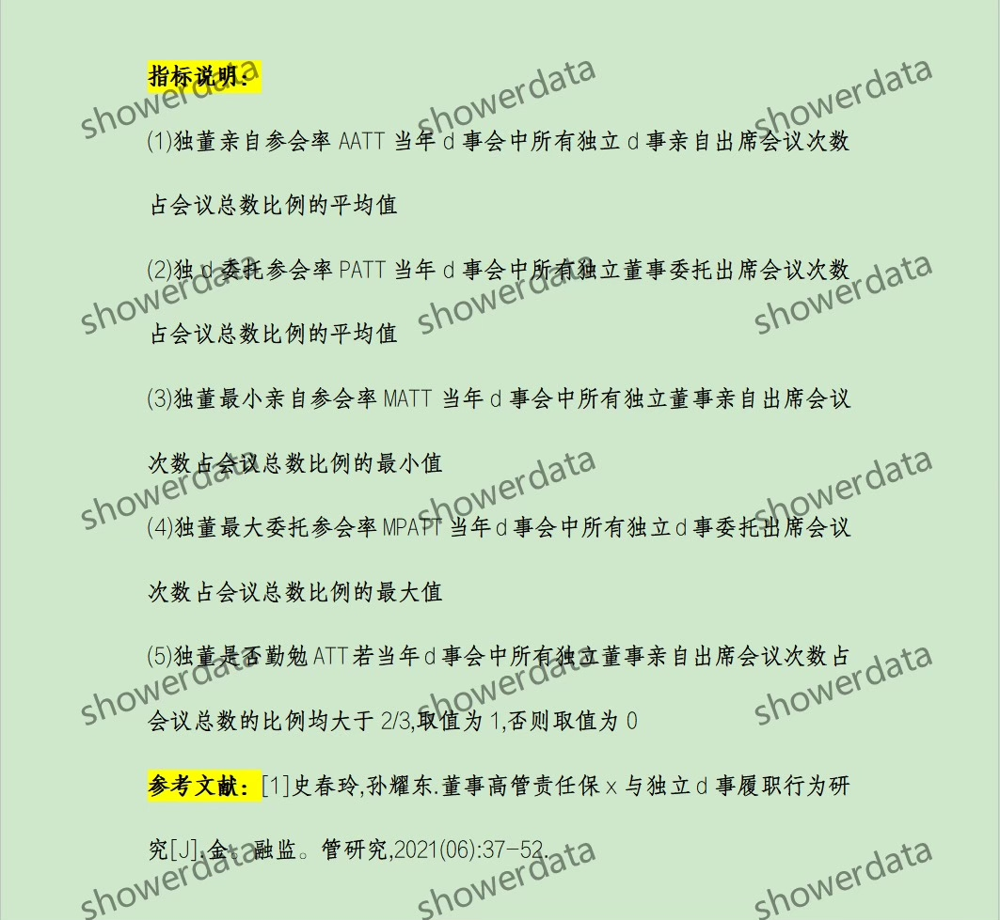
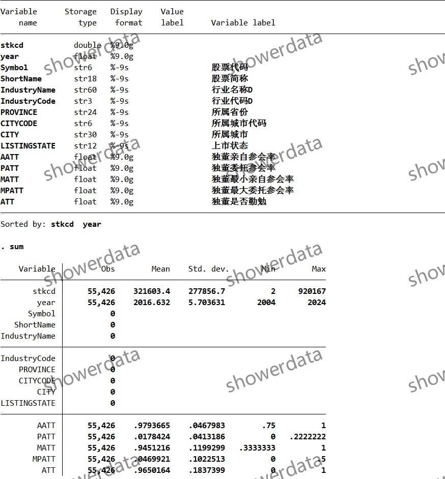
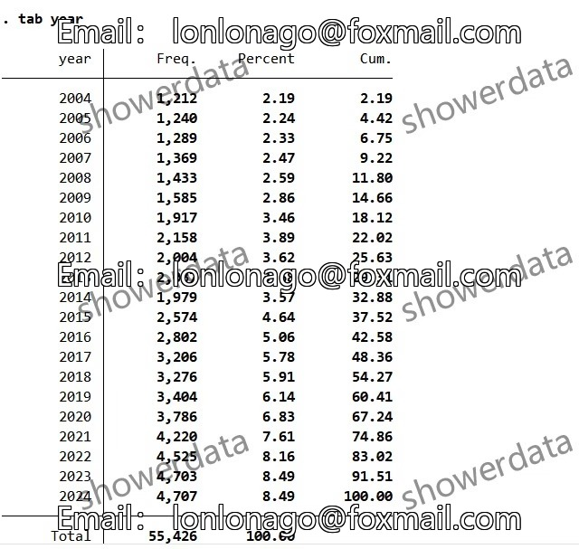
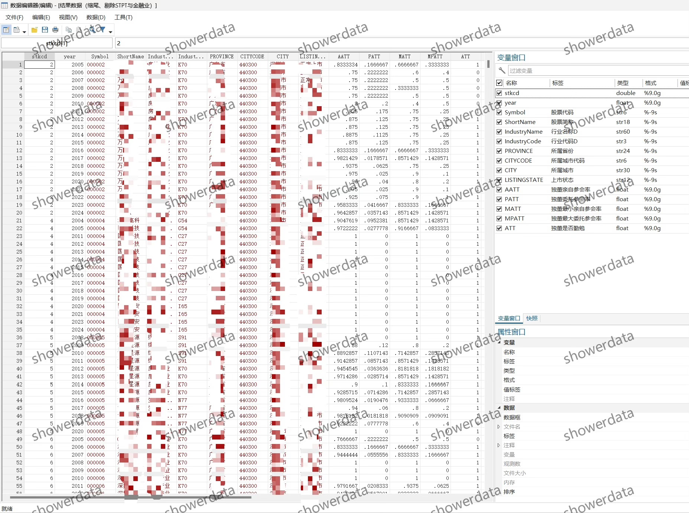
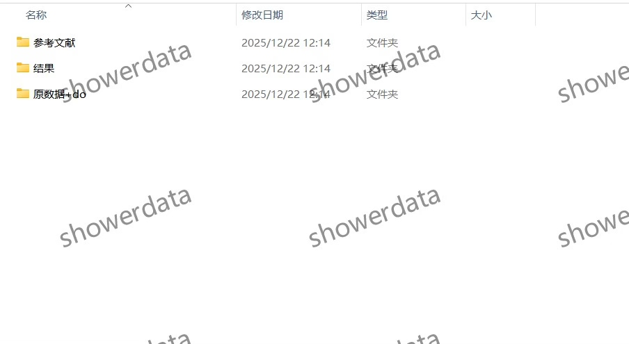

## Body

# 上市公司-独立董事履职行为

## 一、数据介绍

### (1) 数据详情：
请查看下方图片以获取详细信息。在购买前，请确保您已充分了解数据内容。一旦购买，将不接受任何理由的退款或更换。

### (2) 数据名称：
上市公司-独立董事履职行为

### (3) 样本范围：
A鼓尚视公司，未剔除5.9万+条观测值；剔除后5.5万+条观测值,展示结果为已缩尾已剔除

### (4) 时间范围：
2004-2024年

### (5) 结果数据格式：
dta、excel

### (6) 数据内容：
结果（三个版本未缩尾未剔除、已剔除未缩尾、已缩尾已剔除）、参考文献、原始数据、代码

### (7) 原始数据来源：
CS。MAR、年报

## 二、数据结果指标如图所示

## 三、计算方法如图所示

## 四、参考文献如图所示

## Images

Here is a pay link on Stripe ( https://buy.stripe.com/3cs8yP7sY87d0vu9AB ). Please contact me lonlonago@foxmail.com after funding $89, and I will send you a complete data files , thank you!

